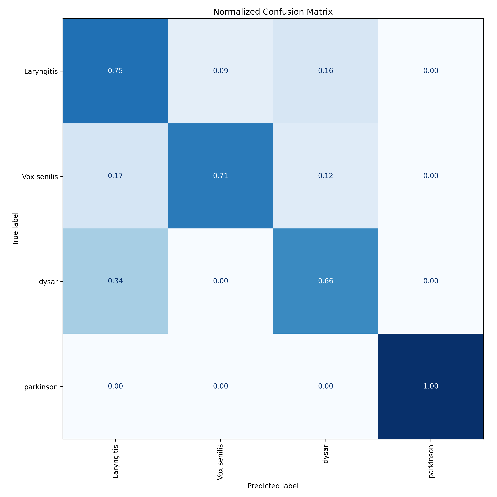
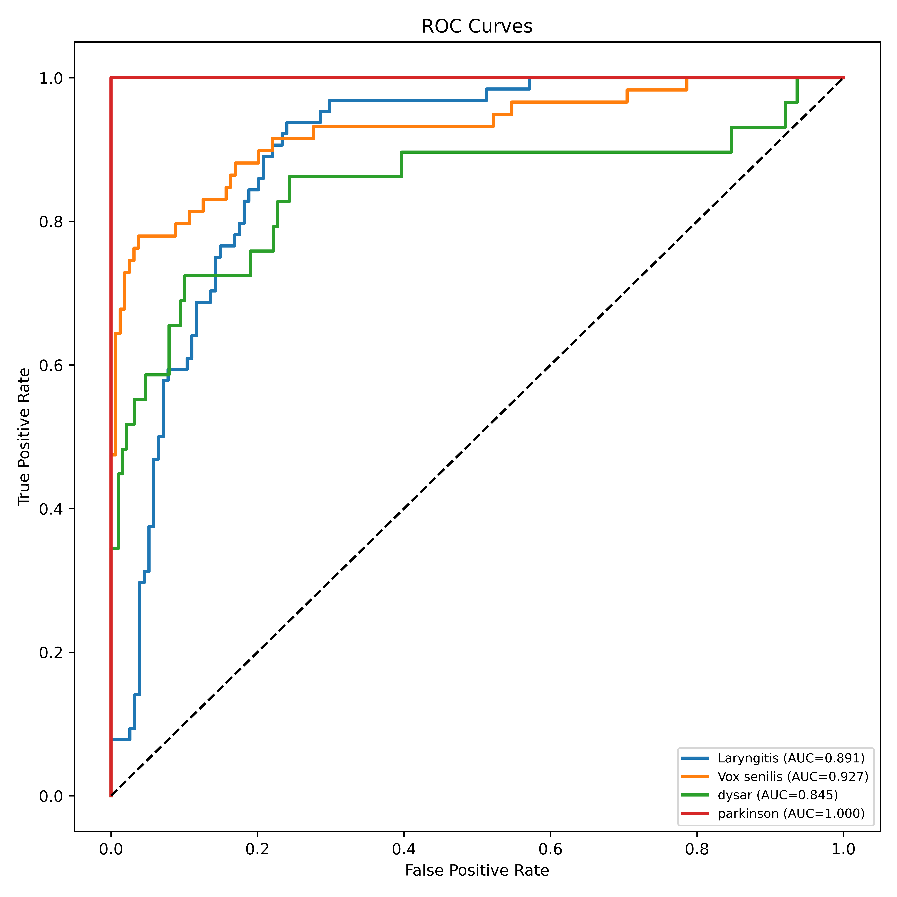
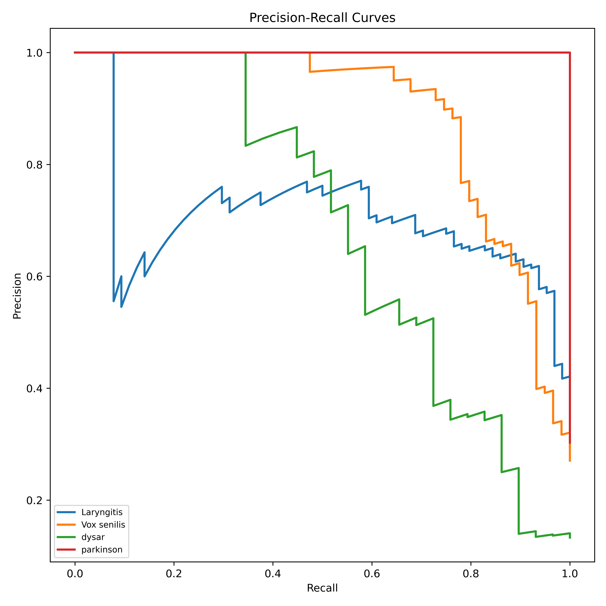

# LingBot Vision vs DINOv3: The Voice Arena

This workspace contains a voice classification pipeline built around a LingBot-Vision backbone and a DINOv3 experiment. The main workflow is implemented in `train2.ipynb`, which trains a classifier on generated images, saves the best checkpoint, and runs the final evaluation.

## Project Overview

The goal of the project is to classify voice/speech samples into four classes:

- `dysar`
- `Laryngitis`
- `parkinson`
- `Vox senilis`

The current LingBot training notebook uses a two-stage transfer learning strategy:

1. Warm up only the classifier head while the backbone stays frozen.
2. Unfreeze the LingBot-Vision backbone and fine-tune the full model with a smaller learning rate.

The workspace also stores the best saved checkpoints and evaluation artifacts generated by the notebook.

## Repository Layout

```text
best_dinov3_svd.pth
best_lingbot_svd.pth
Data.ipynb
dinov3.ipynb
train2.ipynb
dataset_split/
processed_image_dataset/
evaluation_results/
VoiceDS_SHR/
```

### Key Files

- `train2.ipynb`: Main training and evaluation notebook for the LingBot-Vision model.
- `best_lingbot_svd.pth`: Best model checkpoint saved during training.
- `best_dinov3_svd.pth`: Alternate saved checkpoint for a DINOv3-based experiment.
- `evaluation_results/`: Generated evaluation plots and the saved classification report.
- `Data.ipynb`: Notebook used for data preparation or inspection.
- `dinov3.ipynb`: Notebook for an alternate DINOv3 experiment.

## Data Structure

The notebook expects the processed image dataset to be arranged like this:

```text
image_dataset/
  train/
    dysar/
    Laryngitis/
    parkinson/
    Vox senilis/
  val/
    dysar/
    Laryngitis/
    parkinson/
    Vox senilis/
  test/
    dysar/
    Laryngitis/
    parkinson/
    Vox senilis/
```

The workspace also contains:

- `VoiceDS_SHR/`: a raw class-organized voice dataset.
- `dataset_split/`: a train/val/test split in the same class-folder format.

The notebook currently trains from the processed image folders, so the images in that layout are the ones used for model fitting and evaluation.

## Training Workflow

The main notebook performs the following steps:

1. Adds a local LingBot-Vision checkout to `sys.path`.
2. Detects all classes across the train, validation, and test folders so label indices stay consistent.
3. Defines a custom `SpectrogramDataset` for image loading.
4. Applies ImageNet-style normalization and 224 x 224 resizing.
5. Builds a LingBot classifier with a linear/LayerNorm/dropout classification head.
6. Computes class weights from the training split to reduce class imbalance.
7. Trains in two stages:
   - head warmup with the backbone frozen
   - full fine-tuning with the backbone unfrozen or partially unfrozen
8. Saves the best model as `best_lingbot_svd.pth`.
9. Loads the best checkpoint and evaluates on the held-out evaluation split.
10. Generates metrics and plots in `evaluation_results/`.

### Important Training Settings

- Input size: `224 x 224`
- Batch size: `32`
- Head learning rate: `1e-3`
- Backbone learning rate: `2e-5`
- Label smoothing: `0.1`
- Gradient clipping: `1.0`
- Backbone variant: `small`

The notebook uses `CUDA` if available, otherwise it falls back to CPU.

## Dependencies

The notebook imports the following Python packages:

- `torch`
- `torchvision`
- `PIL`
- `tqdm`
- `numpy`
- `matplotlib`
- `scikit-learn`

It also depends on a local LingBot-Vision package checkout, referenced in the notebook with a path similar to:

```text
D:\GermanSVD\lingbot-vision
```

If that path is different on your machine, update the `sys.path.insert(...)` line in `train2.ipynb` before running training.

## Outputs

The evaluation step writes the following artifacts to `evaluation_results/`:

- `classification_report.txt`
- `confusion_matrix.png`
- `confusion_matrix_normalized.png`
- `roc_curves.png`
- `precision_recall_curves.png`
- `normalized_confusion_matrix.png`

## Evaluation Images

The evaluation plots are saved in `evaluation_results/` and can be previewed directly here:








## LingBot vs DINOv3

The current saved LingBot evaluation report shows the following overall comparison snapshot on 218 samples:

- Accuracy: `80.73%`
- Macro F1: `0.7785`
- Weighted F1: `0.8107`

Per-class scores from the saved report:

- `Laryngitis`: precision `0.7188`, recall `0.7188`, F1 `0.7188`
- `Vox senilis`: precision `0.8824`, recall `0.7627`, F1 `0.8182`
- `dysar`: precision `0.5278`, recall `0.6552`, F1 `0.5846`
- `parkinson`: precision `0.9851`, recall `1.0000`, F1 `0.9925`

## How To Run

1. Open `train2.ipynb`.
2. Update the LingBot-Vision path if needed.
3. Confirm the processed image folders contain the expected `train`, `val`, and held-out evaluation splits.
4. Run the notebook from top to bottom.
5. Check `evaluation_results/` for plots and the classification report.

## Notes

- The notebook assumes the input samples are already prepared as image files.
- Class names must match across the training, validation, and held-out evaluation splits.
- The evaluation step uses the same class ordering learned from all splits to avoid label mismatches.
- If you want to experiment with only partial backbone unfreezing, adjust `UNFREEZE_LAST_N_BLOCKS` in the notebook.
